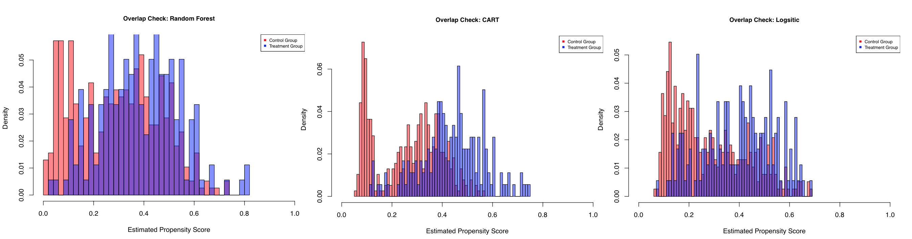
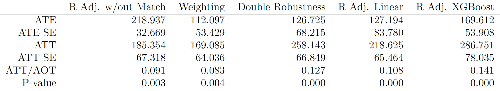

```{r, echo = FALSE, message = FALSE}
# !diagnostics off
knitr::opts_chunk$set(echo = FALSE, message = FALSE, warning = FALSE)
```

```{r}
library(haven)
library(dplyr)
library(ggplot2)
library(gridExtra)
library(cobalt)
library(MatchIt)
library(Matching)
library(xtable)
library(xgboost)
library(randomForest)
library(twang)
```

```{r}
#load, clean data
debit = read_dta("data/debitcard199598.dta")

debit = debit %>%
  mutate(average_age = factor(average_age, labels = c("<30", "31-40", "41-50", "51-65", "65+"))) %>% 
  mutate(householder_age = factor(householder_age, labels = c("<30", "31-40", "41-50", "51-65", "65+"))) %>%
  mutate(geograph_area = factor(geograph_area, labels = c("North", "Central Italy", "South and Islands"))) %>%
  mutate(num_of_inhabitants = factor(num_of_inhabitants, labels = c("<20k", "20-40k", "40-500k", "500k+"))) %>%
  mutate(householder_education = factor(householder_education, labels = c("None", "Elementary", "Middle School", "High School", "Bachelors", "Post-Graduate"))) %>%
  mutate(spending1995 = as.numeric(spending1995), spending1998 = as.numeric(spending1998), debit_card1998 = as.logical(debit_card1998))
```

## Introduction

The goal of this case study is to evaluate the causal impact of debit card ownership on household spending. The data come from the Italy Survey on Household Income and Wealth (SHIW), a 1995-1998 survey of 584 Italian households. The dataset includes 1995 and 1998 monthly household spending, whether the household had exactly one debit card in 1998 and demographic information including family size, geographic region and average age. In this report, we will create a model to estimate the causal impact of debit card ownership on household spending, utilizing propensity score methods to ensure model balance.

## Exploratory Data Analysis

```{r, fig.width=15, fig.height=7, warning=FALSE, message=FALSE}
# simple spending, 95 v 98

spend95 = ggplot(debit, aes(x = spending1995, fill = debit_card1998)) +
  geom_density(alpha = 0.5, show.legend = FALSE) +
  labs(title = "1995 Household Spending", fill = "Debit Card?", x = "Monthly Average Spending ($)", y = "Density") +
  xlim(0, 5000)+
  theme_minimal()

spend98 = ggplot(debit, aes(x = spending1998, fill = debit_card1998)) +
  geom_density(alpha = 0.5, show.legend = FALSE) +
  labs(title = "1998 Household Spending", fill = "Debit Card?", x = "Monthly Average Spending ($)", y = "Density") +
  xlim(0, 5000)+
  theme_minimal()

#change in spending over time

debit = debit %>%
  mutate(delta = spending1998-spending1995)

diff = ggplot(debit, aes(x = delta, fill = debit_card1998)) +
  geom_density(alpha = 0.5) +
  labs(title = "Change in Spending", fill = "Debit Card", x = "Change in Monthly Average Spending ($)", y = "Density") +
  # xlim(0, 5000)+
  theme_minimal()

scatter = ggplot(debit, aes(x = spending1995, y = spending1998, color = debit_card1998))+
  geom_point() +
  theme_minimal() +
  theme(legend.position = "none", legend.title = element_blank())+
  labs(x = "1995 Monthly Household Spending ($)", y = "1998 Monthly Household Spending ($)", fill = "Debit Card?",
       title = "1995 vs 1998 Debit Card Use and Household Spending") +
  geom_smooth(method = "lm")

grid.arrange(spend95, diff, spend98, scatter, nrow = 2)


debit = debit %>%
  mutate(spend95_pct_income = spending1995 / income * 12 * 100) %>%
  mutate(spend98_pct_income = spending1998 / income * 12 * 100) %>%
  mutate(spend95_pct_wealth = spending1995 / wealth * 100) %>%
  mutate(spend98_pct_wealth = spending1998 / wealth * 100)

```

We begin our exploratory data analysis by looking at spending. In 1995 and 1998, households with debit cards tended to spend more than households without. The distribution of difference in household spending is centered at around 0, indicating most households spent about the same amount in 1998 as they did in 1995. The distribution of changes for households with debit cards has slighly more weight on the positive side, indicating that these households may have increased their spending slightly relative to non-debit card households. We also looked into spending as a percentage of income or of wealth, and the results were consistent with those above.

```{r, fig.width=15, fig.height=7, warning=FALSE, message=FALSE}
spend_debit = ggplot(debit, aes(y = spending1998, x = debit_card1998, fill = debit_card1998)) +
  geom_boxplot(width = .1, show.legend = FALSE) +
  geom_violin(trim = TRUE, alpha = .5, show.legend = FALSE) +
  theme_minimal() +
  labs(y = "1998 Spending", x = "Debit Card")

# spend_debit #meh

spend_age = ggplot(debit, aes(y = spending1998, x = average_age, fill = average_age)) +
  geom_boxplot(width = .1, show.legend = FALSE) +
  geom_violin( alpha = .5, show.legend = FALSE) +
  theme_minimal() +
  labs(y = "1998 Spending", x = "Average Age")

# spend_age #not super impactful

spend_hhage = ggplot(debit, aes(y = spending1998, x = householder_age, fill = householder_age)) +
  geom_boxplot(width = .1, show.legend = FALSE) +
  geom_violin( alpha = .5, show.legend = FALSE) +
  theme_minimal() +
  labs(y = "1998 Spending", x = "Head of Household Age")

# spend_hhage #similar to avg age

spend_geo = ggplot(debit, aes(y = spending1998, x = geograph_area, fill = geograph_area)) +
  geom_boxplot(width = .1, show.legend = FALSE) +
  geom_violin( alpha = .5, show.legend = FALSE) +
  theme_minimal() +
  labs(y = "1998 Spending", x = "Geography")

# spend_geo # meh

spend_fam_size = ggplot(debit, aes(y = spending1998, x = as.factor(family_size), fill = as.factor(family_size))) +
  geom_boxplot(width = .1, show.legend = FALSE) +
  geom_violin( alpha = .5, show.legend = FALSE) +
  theme_minimal() +
  labs(y = "1998 Spending", x = "Family Size")

# spend_fam_size # intuitive trend

spend_edu = ggplot(debit, aes(y = spending1998, x = householder_education, fill = householder_education)) +
  geom_boxplot(width = .1, show.legend = FALSE) +
  geom_violin( alpha = .5, show.legend = FALSE) +
  theme_minimal() +
  labs(y = "1998 Spending", x = "Head of Household Education")

# spend_edu # i like

spend_inhab = ggplot(debit, aes(y = spending1998, x = num_of_inhabitants, fill = num_of_inhabitants)) +
  geom_boxplot(width = .1, show.legend = FALSE) +
  geom_violin( alpha = .5, show.legend = FALSE) +
  theme_minimal() +
  labs(y = "1998 Spending", x = "Number of Inhabitants")

# spend_inhab # urban spend more

# ggplot(debit %>% filter(wealth < 1e6), aes(y = wealth, x = householder_education, fill = householder_education)) +
#   geom_boxplot(width = .1, show.legend = FALSE) +
#   geom_violin( alpha = .5, show.legend = FALSE) +
#   theme_minimal() +
#   labs(y = "Wealth", x = "Head of Household Education")


# continuous relationships

spend_wealth = ggplot(debit, aes(y = spending1998, x = wealth, color = debit_card1998))+
  geom_point() +
  theme_minimal() +
  geom_smooth(method = "lm") +
  labs(y = "1998 Spending", x = "Wealth", title = "Wealth vs. Spending")

spend_inc = ggplot(debit, aes(y = spending1998, x = income, color = debit_card1998))+
  geom_point() +
  theme_minimal() +
  geom_smooth(method = "lm") +
  labs(y = "1998 Spending", x = "Income", title = "Income vs. Spending")

# spend_inc # same as wealth

spend_ir = ggplot(debit, aes(y = spending1998, x = interest_rate, color = debit_card1998))+
  geom_point() +
  theme_minimal() +
  geom_smooth(method = "lm") +
  ylim(0, 5000) +
  labs(y = "1998 Spending", x = "Interest Rate", title = "Interest Rate vs. Spending")

# spend_ir # no real relationship

spend_banks = ggplot(debit %>% filter(num_of_banks < 500), aes(y = spending1998, x = num_of_banks, color = debit_card1998))+
  geom_point() +
  theme_minimal() +
  geom_smooth(method = "lm") +
  # ylim(0, 5000) +
  labs(y = "1998 Spending", x = "Number of Banks", title = "Banks vs. Spending")

# spend_banks # no relationship


grid.arrange(arrangeGrob(spend_edu, spend_fam_size, ncol = 1), spend_wealth, nrow = 1)
```

We then examined relationships between demographic characteristics and 1998 spending. Some selected plots are shown above. Our initial analysis indicates that family size is positively associated with spending, which is intuitive given the cost of raising children. Additionally, families with household heads who have higher educational status tend to spend more than those headed by less educated individuals. This may be a function of income or wealth, as higher educated individuals tend to earn more; regardless, it is worth exploring further. Finally, both income and wealth are positively associated with spending, and households with debit cards tend to spend more at all levels of income and wealth. 

We move forward with attempts to balance the covariates using matching, weighting and propensity scores as these plots illustrate significant differences in the covariates between the treatment and control groups. 
y = "1998 Spending (% of Income)", x = "Geography")


## Data Balancing

To examine data balance between control and treatment groups, we looked at three different propensity score models: logistic regression, random forest, and CART, a decision-tree based machine learning model. The overlap in propensity scores for each model is shown below. Logistic regression and random forest show good overlap, whereas CART does not. Given that logistic and random forest perform similarly, and logistic regression is a simpler and more interpretable model, we will use the logistic regression model for propensity scores.



[TODO: Get rid of excess outputhistograms, etc]

```{r}
debit = read_dta("data/debitcard199598.dta")

debit = debit %>%
  mutate(num_of_earners = as.factor(num_of_earners)) %>%
  mutate(family_size = as.factor(family_size)) %>%
  mutate(average_age = factor(average_age, labels = c("<30", "31-40", "41-50", "51-65", "65+")))  %>%
  mutate(geograph_area = factor(geograph_area, labels = c("North", "Central Italy", "South and Islands"))) %>%
  mutate(num_of_inhabitants = factor(num_of_inhabitants, labels = c("<20k", "20-40k", "40-500k", "500k+"))) %>%
  mutate(householder_age = factor(householder_age, labels = c("<30", "31-40", "41-50", "51-65", "65+"))) %>%
  mutate(householder_education = factor(householder_education, labels = c("None", "Elementary", "Middle School", "High School", "Bachelors", "Post-Graduate")))


#Continuous Variables
#names(which(unlist(lapply(debit,class))=="numeric"))

#Categorical Variables
#names(which(unlist(lapply(debit,class))=="factor"))

n_indi<-c(which(unlist(lapply(debit,class))=="numeric"))
c_indi<-c(which(unlist(lapply(debit,class))=="factor"))

#Descriptive Comparison
data_t<-subset(debit,debit_card1998==1)
data_c<-subset(debit,debit_card1998==0)
size_t<-dim(data_t)[1]
size_c<-dim(data_c)[1]
```


```{r, results = "hide", warning=FALSE, message=FALSE}
#PS methods

basicLog = glm(debit_card1998 ~ spending1995 + num_of_earners + average_age + family_size + geograph_area +  num_of_inhabitants + householder_age + householder_education + num_of_banks + interest_rate + income + wealth + cash_inventory, family = binomial(link="logit"), data = debit)

randomForest = randomForest(as.factor(debit_card1998) ~ spending1995 + num_of_earners + average_age + family_size + geograph_area +  num_of_inhabitants + householder_age + householder_education + num_of_banks + interest_rate + income + wealth + cash_inventory, data = debit)

CART = ps(debit_card1998 ~ spending1995 + num_of_earners + average_age + family_size + geograph_area +  num_of_inhabitants + householder_age + householder_education + num_of_banks + interest_rate + income + wealth + cash_inventory, data = as.data.frame(debit))

debit.ps = debit
debit.ps$ps_basicLog = fitted(basicLog)
debit.ps$ps_randomForest = randomForest$votes[, 2]
debit.ps$ps_CART = CART$ps[, 1]

#basicLog
a<-hist(debit.ps$ps_basicLog[which(debit.ps$debit_card1998==0)],breaks=50,freq=FALSE)
a$counts<-a$counts/sum(a$counts)

b<-hist(debit.ps$ps_basicLog[which(debit.ps$debit_card1998==1)],breaks=50,add=TRUE)
b$counts<-b$counts/sum(b$counts)

pdf("prophist_basicLog.pdf",width=8,height=6)
plot(a,col=rgb(1,0,0,0.5),main="Overlap Check: Logsitic",cex.main=0.9,xlab="Estimated Propensity Score",ylab="Density",xlim=c(0,1))
plot(b,add=TRUE,col=rgb(0,0,1,0.5),main="Overlap Check: Logistic",xlab="Estimated Propensity Score",ylab="Density")
legend("topright",legend=c("Control Group","Treatment Group"),col=c("red","blue"),pch=15,cex=0.7)
dev.off()

#randomForest
a<-hist(debit.ps$ps_randomForest[which(debit.ps$debit_card1998==0)],breaks=50,freq=FALSE)
a$counts<-a$counts/sum(a$counts)

b<-hist(debit.ps$ps_randomForest[which(debit.ps$debit_card1998==1)],breaks=50,add=TRUE)
b$counts<-b$counts/sum(b$counts)

pdf("prophist_randomForest.pdf",width=8,height=6)
plot(a,col=rgb(1,0,0,0.5),main="Overlap Check: Random Forest",cex.main=0.9,xlab="Estimated Propensity Score",ylab="Density",xlim=c(0,1))
plot(b,add=TRUE,col=rgb(0,0,1,0.5),main="Overlap Check",xlab="Estimated Propensity Score",ylab="Density")
legend("topright",legend=c("Control Group","Treatment Group"),col=c("red","blue"),pch=15,cex=0.7)
dev.off()

#CART
a<-hist(debit.ps$ps_CART[which(debit.ps$debit_card1998==0)],breaks=50,freq=FALSE)
a$counts<-a$counts/sum(a$counts)

b<-hist(debit.ps$ps_CART[which(debit.ps$debit_card1998==1)],breaks=50,add=TRUE)
b$counts<-b$counts/sum(b$counts)

pdf("prophist_CART.pdf",width=8,height=6)
plot(a,col=rgb(1,0,0,0.5),main="Overlap Check: CART",cex.main=0.9,xlab="Estimated Propensity Score",ylab="Density",xlim=c(0,1))
plot(b,add=TRUE,col=rgb(0,0,1,0.5),main="Overlap Check",xlab="Estimated Propensity Score",ylab="Density")
legend("topright",legend=c("Control Group","Treatment Group"),col=c("red","blue"),pch=15,cex=0.7)
dev.off()
```

```{r}
################################################
#  Exclude samples in nonoverlapping region   ##
################################################ 
low_bound<-max(min(debit.ps$ps_basicLog[which(debit.ps$debit_card1998==1)]),
               min(debit.ps$ps_basicLog[which(debit.ps$debit_card1998==0)]))

up_bound<-min(max(debit.ps$ps_basicLog[which(debit.ps$debit_card1998==1)]),
              max(debit.ps$ps_basicLog[which(debit.ps$debit_card1998==0)]))

#Disgard the sample out of the common support
olp.debit<-subset(debit.ps,debit.ps$ps_basicLog>=low_bound&debit.ps$ps_basicLog<=up_bound)

olp.debit= olp.debit %>% 
  mutate(ipw_bl = ps_basicLog/(1-ps_basicLog)) %>%
  mutate(ipw_rf = ps_randomForest/(1-ps_randomForest)) %>%
  mutate(ipw_CART = ps_CART/(1-ps_CART))

#weighting basic Log
debit.basicLog_weight=bal.tab(olp.debit[,-c(1,2,16:21)],treat=olp.debit$debit_card1998,method="weighting", weights=olp.debit$ipw_bl,estimand="ATT")

ATT_ipw_bl<-(olp.debit%>%filter(debit_card1998==TRUE)%>%summarise(mean=mean(spending1998)))-sum((olp.debit%>%filter(debit_card1998==FALSE))%>%pull(ipw_bl)*olp.debit%>%filter(debit_card1998==FALSE)%>%pull(spending1998))/sum((olp.debit%>%filter(debit_card1998==FALSE)%>%pull(ipw_bl)))

ATE_ipw_bl<-sum(olp.debit%>%filter(debit_card1998==TRUE)%>%pull(spending1998)/olp.debit%>%filter(debit_card1998==TRUE)%>%pull(ps_basicLog))/sum(1/(olp.debit%>%filter(debit_card1998==TRUE)%>%pull(ps_basicLog)))-sum(olp.debit%>%filter(debit_card1998==FALSE)%>%pull(spending1998)/(1-olp.debit%>%filter(debit_card1998==FALSE)%>%pull(ps_basicLog)))/sum(1/(1-olp.debit%>%filter(debit_card1998==FALSE)%>%pull(ps_basicLog)))

#weighting random Forest
#  Exclude samples in nonoverlapping region   
low_bound<-max(min(debit.ps$ps_randomForest[which(debit.ps$debit_card1998==1)]),
               min(debit.ps$ps_randomForest[which(debit.ps$debit_card1998==0)]))

up_bound<-min(max(debit.ps$ps_randomForest[which(debit.ps$debit_card1998==1)]),
              max(debit.ps$ps_randomForest[which(debit.ps$debit_card1998==0)]))

#Disgard the sample out of the common support
olp.debit<-subset(debit.ps,debit.ps$ps_randomForest>=low_bound&debit.ps$ps_randomForest<=up_bound)

olp.debit= olp.debit %>% 
  mutate(ipw_bl = ps_basicLog/(1-ps_basicLog)) %>%
  mutate(ipw_rf = ps_randomForest/(1-ps_randomForest)) %>%
  mutate(ipw_CART = ps_CART/(1-ps_CART))

debit.randomForest_weight=bal.tab(olp.debit[,-c(1,2,16:21)],treat=olp.debit$debit_card1998,method="weighting", weights=olp.debit$ipw_rf,estimand="ATT")

ATT_ipw_rf<-(olp.debit%>%filter(debit_card1998==TRUE)%>%summarise(mean=mean(spending1998)))-sum((olp.debit%>%filter(debit_card1998==FALSE))%>%pull(ipw_rf)*olp.debit%>%filter(debit_card1998==FALSE)%>%pull(spending1998))/sum((olp.debit%>%filter(debit_card1998==FALSE)%>%pull(ipw_rf)))

ATE_ipw_rf<-sum(olp.debit%>%filter(debit_card1998==TRUE)%>%pull(spending1998)/olp.debit%>%filter(debit_card1998==TRUE)%>%pull(ps_basicLog))/sum(1/(olp.debit%>%filter(debit_card1998==TRUE)%>%pull(ps_randomForest)))-sum(olp.debit%>%filter(debit_card1998==FALSE)%>%pull(spending1998)/(1-olp.debit%>%filter(debit_card1998==FALSE)%>%pull(ps_randomForest)))/sum(1/(1-olp.debit%>%filter(debit_card1998==FALSE)%>%pull(ps_randomForest)))


#weighting CART
#  Exclude samples in nonoverlapping region   
low_bound<-max(min(debit.ps$ps_CART[which(debit.ps$debit_card1998==1)]),
               min(debit.ps$ps_CART[which(debit.ps$debit_card1998==0)]))

up_bound<-min(max(debit.ps$ps_CART[which(debit.ps$debit_card1998==1)]),
              max(debit.ps$ps_CART[which(debit.ps$debit_card1998==0)]))

#Disgard the sample out of the common support
olp.debit<-subset(debit.ps,debit.ps$ps_CART>=low_bound&debit.ps$ps_CART<=up_bound)

olp.debit= olp.debit %>% 
  mutate(ipw_bl = ps_basicLog/(1-ps_basicLog)) %>%
  mutate(ipw_rf = ps_randomForest/(1-ps_randomForest)) %>%
  mutate(ipw_CART = ps_CART/(1-ps_CART))

debit.CART_weight=bal.tab(olp.debit[,-c(1,2,16:21)],treat=olp.debit$debit_card1998,method="weighting", weights=olp.debit$ipw_CART,estimand="ATT")

ATT_ipw_CART<-(olp.debit%>%filter(debit_card1998==TRUE)%>%summarise(mean=mean(spending1998)))-sum((olp.debit%>%filter(debit_card1998==FALSE))%>%pull(ipw_CART)*olp.debit%>%filter(debit_card1998==FALSE)%>%pull(spending1998))/sum((olp.debit%>%filter(debit_card1998==FALSE)%>%pull(ipw_CART)))

ATE_ipw_CART<-sum(olp.debit%>%filter(debit_card1998==TRUE)%>%pull(spending1998)/olp.debit%>%filter(debit_card1998==TRUE)%>%pull(ps_basicLog))/sum(1/(olp.debit%>%filter(debit_card1998==TRUE)%>%pull(ps_CART)))-sum(olp.debit%>%filter(debit_card1998==FALSE)%>%pull(spending1998)/(1-olp.debit%>%filter(debit_card1998==FALSE)%>%pull(ps_CART)))/sum(1/(1-olp.debit%>%filter(debit_card1998==FALSE)%>%pull(ps_CART)))
```

[TODO: Fix all loveplots, focus on matching]


```{r}
#loveplots
love.plot(debit.basicLog_weight,
          drop.distance = TRUE, 
          var.order = "unadjusted",
          line = TRUE, 
          threshold = .1,
          stars = "raw")

love.plot(debit.randomForest_weight,
          drop.distance = TRUE, 
          var.order = "unadjusted",
          line = TRUE, 
          threshold = .1,
          stars = "raw")

love.plot(debit.CART_weight,
          drop.distance = TRUE, 
          var.order = "unadjusted",
          line = TRUE, 
          threshold = .1,
          stars = "raw")
```

```{r}

treated<- which(olp.debit$debit_card1998 == 1)
control<-which(olp.debit$debit_card1998 == 0)
treat_size<-length(treated)
control_size<-dim(olp.debit)[1]-treat_size

olp_sd<-apply(data.matrix(olp.debit[,-c(1,2,16:21)]),MARGIN=2,FUN=function(x)
{sqrt(var(x[treated])/treat_size+var(x[control])/control_size)})

ipw_bl_data<-apply(data.matrix(olp.debit[,-c(1,2,16:21)]),MARGIN=2,FUN=function(x){abs(mean(x[treated])-sum(x[control]*olp.debit$ps_basicLog[control])/sum(olp.debit$ps_basicLog[control]))})

weight_bl_asd<-ipw_bl_data/olp_sd

ipw_rf_data<-apply(data.matrix(olp.debit[,-c(1,2,16:21)]),MARGIN=2,FUN=function(x){abs(mean(x[treated])-sum(x[control]*olp.debit$ps_randomForest[control])/sum(olp.debit$ps_randomForest[control]))})

weight_rf_asd<-ipw_rf_data/olp_sd

ipw_CART_data<-apply(data.matrix(olp.debit[,-c(1,2,16:21)]),MARGIN=2,FUN=function(x){abs(mean(x[treated])-sum(x[control]*olp.debit$ps_CART[control])/sum(olp.debit$ps_CART[control]))})

weight_CART_asd<-ipw_CART_data/olp_sd

#original
ori_d<-apply(data.matrix(debit[,-c(1,2)]),MARGIN=2,FUN=function(x){
  abs(mean(x[debit$debit_card1998==1])-mean(x[debit$debit_card1998==0]))})

sd<-apply(data.matrix(debit[,-c(1,2)]),MARGIN=2,FUN=function(x)
{sqrt(var(x[debit$debit_card1998==1])/sum(debit$debit_card1998)+var(x[debit$debit_card1998==0])/sum(1-debit$debit_card1998))})

ori_asd<-ori_d/sd

#More matching
#1:1
ATE_matching_1<-Match(Y=olp.debit$spending1998,Tr=olp.debit$debit_card1998,estimand = "ATE",
                  X=data.matrix(olp.debit[,-c(1,2,16:21)]),M=1,Weight = 1)

ATT_matching_1<-Match(Y=olp.debit$spending1998,Tr=olp.debit$debit_card1998,estimand = "ATT",
                      X=data.matrix(olp.debit[,-c(1,2,16:21)]),M=1,Weight = 1)

treated1<-unique(ATT_matching_1$index.treated)
control1<-ATT_matching_1$index.control
treat_size1<-length(treated1)
control_size1<-dim(olp.debit)[1]-treat_size


match_d_1<-apply(data.matrix(olp.debit[,-c(1,2,16:21)]),MARGIN=2,FUN=function(x)
{abs(mean(x[treated1])-mean(x[control1]))})

olp_sd1<-apply(data.matrix(olp.debit[,-c(1,2,16:21)]),MARGIN=2,FUN=function(x)
{sqrt(var(x[treated1])/treat_size+var(x[control1])/control_size1)})

match_asd_1<-match_d_1/olp_sd1

ori.df = as.data.frame(ori_asd)
match.df1 = as.data.frame(match_asd_1)
ori.match1.df = cbind(ori.df, match.df1)

ggplot(data = ori.match1.df, aes(y = rownames(ori.match1.df))) + geom_point(aes(x = match_asd_1, colour = "matched")) + geom_point(aes(x = ori_asd, colour = "original")) + xlab("Absolute Standardized Difference") +ylab("Covariate")


#1:3

ATE_matching_3<-Match(Y=olp.debit$spending1998,Tr=olp.debit$debit_card1998,estimand = "ATE",
                  X=data.matrix(olp.debit[,-c(1,2,16:21)]),M=3,Weight = 1)

ATT_matching_3<-Match(Y=olp.debit$spending1998,Tr=olp.debit$debit_card1998,estimand = "ATT",
                      X=data.matrix(olp.debit[,-c(1,2,16:21)]),M=3,Weight = 1)

treated3<-unique(ATT_matching_3$index.treated)
control3<-ATT_matching_3$index.control
treat_size3<-length(treated)
control_size3<-dim(olp.debit)[1]-treat_size

olp_sd3<-apply(data.matrix(olp.debit[,-c(1,2,16:21)]),MARGIN=2,FUN=function(x)
{sqrt(var(x[treated3])/treat_size+var(x[control3])/control_size3)})

match_d_3<-apply(data.matrix(olp.debit[,-c(1,2,16:21)]),MARGIN=2,FUN=function(x)
{abs(mean(x[treated3])-mean(x[control3]))})
match_asd_3<-match_d_3/olp_sd3

pdf("asd_compare.pdf",width=8,height=6)
boxplot(ori_asd, match_asd_1, match_asd_3, weight_bl_asd, weight_rf_asd, weight_CART_asd, main="ASD for Different Methods",names=c("original", "1:1M", "1:3M", "Logistic Wt","RF Wt","CART Wt"),ylab="Abs Standardized Difference")
dev.off()

ori.df = as.data.frame(ori_asd)
match.df3 = as.data.frame(match_asd_3)
ori.match3.df = cbind(ori.df, match.df3)

ggplot(data = ori.match3.df, aes(y = rownames(ori.match1.df))) + geom_point(aes(x = match_asd_1, colour = "matched")) + geom_point(aes(x = ori_asd, colour = "original")) + xlab("Absolute Standardized Difference") +ylab("Covariate")
```
[TODO: Add lines, categorical variables to matching love plots]

[TODO: Discussion of why we're choosing 1:1 matching for regression adjustment]


Moving forward with 1:1 matching, we see that the absolute standardised differences are improved significantly across almost all covariates.

## Regression Adjustment

We attempt to fit models on top of the 1:1 matching with replacement. We first use a basic linear model before fitting more flexible models, random forest and extreme gradient boosting.

```{r}
#Model set-up
outcome_formula = function()
{
  return(spending1998 ~ spending1995 + num_of_earners + average_age + family_size + geograph_area + num_of_inhabitants + householder_age + householder_education + num_of_banks + interest_rate + income + wealth + cash_inventory)
}


#Regression Adjustment with Linear Model before matching
controls = debit %>% filter(debit_card1998 == 0)
treats = debit %>% filter(debit_card1998 == 1)

#Models
model_control <- glm(outcome_formula(), data = debit %>% filter(debit_card1998 == 0))
model_treated <- glm(outcome_formula(), data = debit %>% filter(debit_card1998 == 1))

#ATT
mu1 = predict(model_control, newdata=debit %>% filter(debit_card1998 == 1), type = "response") 

ATT_lin_reg <- mean(treats$spending1998-mu1)

ATE_lin_reg<-(sum(treats$spending1998-predict(model_control,newdata = treats,type="response"))-
  sum(controls$spending1998-predict(model_treated,newdata =
                                      controls,type="response")))/dim(debit)[1]


# Use 1:1 Matching moving forward

controls = olp.debit[ATT_matching_1$index.control, ]
control_X = controls[, -c(1,2,16:21)]
control_Y = controls$spending1998

treats = olp.debit[ATT_matching_1$index.treated, ] %>% filter(num_of_earners != 5) %>% filter(family_size != 6)
treat_X = treats[,-c(1,2,16:21)]
treat_Y = treats$spending1998


#Regression Adjustment with Linear Model on top of 1:1 matching

#Models
model_control <- lm(outcome_formula(), data = controls)
model_treated <- lm(outcome_formula(), data = treats)

#ATT
mu1 = predict(model_control, newdata=control_X, type = "response") 
mu2 = predict(model_control, newdata=treat_X, type = "response") # How do I deal with the models having different actual covariates

ATT_mix=mean(olp.debit %>% filter(debit_card1998 == 1) %>% dplyr::select(spending1998) %>% unlist())-sum(olp.debit[ATT_matching_1$index.control,"spending1998"]+mu2-mu1)/(treat_size1)

#ATE
mu3 = predict(model_control, newdata=controls,type="response")
mu4 = predict(model_control, newdata=treats,type="response")
mu5 =predict(model_treated, newdata=controls,type="response")
mu6 = predict(model_treated, newdata=treats,type="response")
ATE_mix = ATE_matching_1$est - (-sum(mu3) + sum(mu4) - sum(mu5) + sum(mu6))/(dim(olp.debit)[1])


#Regression Adjustment with XGBoost

#Models
model_control_boost <- xgboost(data=data.matrix(control_X), label = data.matrix(control_Y), nrounds = 30, verbose = 0)
model_treat_boost <- xgboost(data=data.matrix(treat_X), label = data.matrix(treat_Y), nrounds = 30, verbose = 0)

#ATT
mu1=predict(model_control_boost,newdata=data.matrix(control_X),type="response")
mu2=predict(model_control_boost,newdata=data.matrix(treat_X),type="response")

ATT_mix_boost=mean(olp.debit %>% filter(debit_card1998 == 1) %>% dplyr::select(spending1998) %>% unlist())-sum(olp.debit[ATT_matching_1$index.control,"spending1998"]+mu2-mu1)/(treat_size1)

#ATE
mu3=predict(model_control_boost,newdata=data.matrix(control_X),type="response")
mu4=predict(model_control_boost,newdata=data.matrix(treat_X),type="response")
mu5=predict(model_treat_boost,newdata=data.matrix(control_X),type="response")
mu6=predict(model_treat_boost,newdata=data.matrix(treat_X),type="response")
ATE_mix_boost=ATE_matching_1$est-(-sum(mu3)+sum(mu4)-sum(mu5)+sum(mu6))/(dim(olp.debit)[1])


#Regression Adjustment with Random Forest

#Models
model_control_forest <- randomForest(spending1998 ~ spending1995 + num_of_earners + average_age + family_size + geograph_area +  num_of_inhabitants + householder_age + householder_education + num_of_banks + interest_rate + income + wealth + cash_inventory, data = controls)

model_treat_forest <- randomForest(spending1998 ~ spending1995 + num_of_earners + average_age + family_size + geograph_area +  num_of_inhabitants + householder_age + householder_education + num_of_banks + interest_rate + income + wealth + cash_inventory, data = treats)

#ATT
mu1=predict(model_control_forest,newdata=control_X,type="response")
mu2=predict(model_control_forest,newdata=treat_X,type="response")

ATT_mix_forest=mean(olp.debit %>% filter(debit_card1998 == 1) %>% dplyr::select(spending1998) %>% unlist())-sum(olp.debit[ATT_matching_1$index.control,"spending1998"]+mu2-mu1)/(treat_size1)

#ATE
mu3=predict(model_control_forest,newdata=control_X,type="response")
mu4=predict(model_control_forest,newdata=treat_X,type="response")
mu5=predict(model_treat_forest,newdata=control_X,type="response")
mu6=predict(model_treat_forest,newdata=treat_X,type="response")
ATE_mix_forest=ATE_matching_1$est-(-sum(mu3)+sum(mu4)-sum(mu5)+sum(mu6))/(dim(olp.debit)[1])

data.frame(
  ATT_lin_reg, ATE_lin_reg,
  ATT_mix, ATE_mix,
  ATT_mix_boost, ATE_mix_boost, 
  ATT_mix_forest, ATE_mix_forest
  )
```

The motivation for regression adjustment is to impute missing potential outcomes by fitting models to the unobserved counterparts of observed data subsets. We have elected to include a regression adjustment in addition to our propensity score matching as it allows us to mitigate the sensitivity of our models to the model specification used to impute these unobsereved values, specifically as it pertains to the covariate imbalance.
<\br>
As described above, our 1:1 matched data has demonstrated the most compelling distribution of absolute standardised difference, and therefore yields the most strongest results for the overlap of data through a propensity score methodology. Thus we partitioned the data into treatment and control groups through the 1:1 mathcing method, and then imputed unobserved control values for the observed treatment values, and vice versa for the observed control values.
<\br>
We began testing our models by running a simple linear (OLS) model on the original unmatched dataset. The results of this test proved unfruitful as the ATT for this model was lower than the corresponding ATE. This suggests that the effect of individuals who were observed to own debit cards in 1998 spent on average 185 more than those who did not. Furthermore, the unmatched model suggests that after imputing control values for those who did own a debit card in 1998, that the implied treatment effect increased to 218 in spending. Ergo, the model implies that those who recieved the treatment would have spent less than those in the corresponding observed control group. Intutively, this reinforces our intuition to use the matched data as it would allow our model to account for unoberserved confounders better, and therfore allowing for stronger causal inference
<\br>
As illustrated by the table above, the ATT is higher than the ATE across all models that were built with the 1:1 matched data. Intutively, this suggests that matching enabled us to obviate a case of Simpson's Paradox as the unmatched model demonstrated the opposite intuition.
<\br>
In terms of the flexibility of our models, the machine learning models (the gradient boost and random forest) are intrinsically more flexible than our OLS model as they learn from previous errors by design. That being said, it somewhat cumbersome to ascertain which of our machine learning models is in fact more flexible. The forest is useful as it is easier to fit as it only depends on the number of trees and the number of factors selected; in addition, the forest does not overfit the data as much as the boosted model. Nevertheless, the boosted model is also compelling as it is capable of optimising a broader selection of objective function than the forest, and typically leads to more accuracy with fewer trees. The complexity of the data at hand has led us to prefer our boosted model, which yielded the highest ATT (286) and ATE (169).

```{r}
#Double Robustness
#ATT DR

olp.debit_modelling <- olp.debit %>% filter(num_of_earners != 5) %>% filter(family_size != 6) %>% filter(family_size != 7)


#ATT DR
ATT_DR<-mean(olp.debit[treated1,]$spending1998, na.rm = TRUE)-sum((olp.debit_modelling$spending1998*(1-olp.debit_modelling$debit_card1998)*olp.debit_modelling$ps_basicLog+predict(model_control,newdata=olp.debit_modelling,type="response")*(olp.debit_modelling$debit_card1998-olp.debit_modelling$ps_basicLog))/(1-olp.debit_modelling$ps_basicLog))/length(treated1)
      
#ATE DR
ATE_DR <-mean(olp.debit$debit_card1998*olp.debit$spending1998/olp.debit$ps_basicLog)-mean((olp.debit_modelling$debit_card1998-olp.debit_modelling$ps_basicLog)*predict(model_treated,newdata=olp.debit_modelling,type="response")/olp.debit_modelling$ps_basicLog)-mean((1-olp.debit_modelling$debit_card1998)*olp.debit_modelling$spending1998/(1-olp.debit_modelling$ps_basicLog))-mean((olp.debit_modelling$debit_card1998-olp.debit_modelling$ps_basicLog)*predict(model_control,newdata=olp.debit_modelling,type="response")/(1-olp.debit_modelling$ps_basicLog))
```

```{r}
#Bootstrap to Get the Variance

B=500
b_IPW1<-b_IPW2<-b_ATT_lin_reg<-b_ATE_lin_reg<-numeric(B)
b_DR1<-b_DR2<-b_mix1<-b_mix2<-b_mix1_boost<-b_mix2_boost<-b_mix1_forest<-b_mix2_forest<-numeric(B)
for (i in (1:B))
{
  #Resample Data
  tryCatch({
    b_index<-sample(1:dim(debit)[1],size=dim(debit)[1],replace = T)
    bdata<-debit[b_index,]
    bdata$cat1<-NULL
    bdata$cat2<-NULL
    bn_indi<-c(which(unlist(lapply(bdata,class))=="numeric"),which(unlist(lapply(bdata,class))=="integer"))
    bc_indi<-c(which(unlist(lapply(bdata[,c(-1)],class))=="logical"),which(unlist(lapply(bdata,class))=="factor"))
    
    #Ensure both debit_card1998 and control group
    if(var(bdata$debit_card1998)>0)
    {
      #PS
      b_model<-glm(debit_card1998 ~ spending1995 + num_of_earners + average_age + family_size + geograph_area +  num_of_inhabitants + householder_age + householder_education + num_of_banks + interest_rate + income + wealth + cash_inventory, family = binomial(link="logit"), data = bdata)
      
      bdata$ps<-fitted(b_model)
      
      #Check Overlap: this step is not always necessary 
      low_b<-max(min(bdata$ps[which(bdata$debit_card1998==1)]),
                 min(bdata$ps[which(bdata$debit_card1998==0)]))
      
      up_b<-min(max(bdata$ps[which(bdata$debit_card1998==1)]),
                max(bdata$ps[which(bdata$debit_card1998==0)]))
      bdata<-subset(bdata,bdata$ps>=low_b&bdata$ps<=up_b)

      
#Matching/Mix
      
      #1:1
      b_ATE_matching_m<-Match(Y=bdata$spending1998,Tr=bdata$debit_card1998,estimand = "ATE",
                        X=data.matrix(bdata[,-c(1,2,16)]),M=1,Weight = 1)
      
      b_ATT_matching_m<-Match(Y=bdata$spending1998,Tr=bdata$debit_card1998,estimand = "ATT",
                              X=data.matrix(bdata[,-c(1,2,16)]),M=1,Weight = 1)
      treated<-unique(b_ATT_matching_m$index.treated)
      control<-b_ATT_matching_m$index.control
      treat_size<-length(treated)
      control_size<-dim(bdata)[1]-treat_size
      
      #Regression Adjustment with Linear Model before matching
      controls = bdata %>% filter(debit_card1998 == 0)
      treats = bdata %>% filter(debit_card1998 == 1)
      #Models
      model_control <- glm(outcome_formula(), data = debit %>% filter(debit_card1998 == 0))
      model_treated <- glm(outcome_formula(), data = debit %>% filter(debit_card1998 == 1))

      #ATT
      mu1 = predict(model_control, newdata=debit %>% filter(debit_card1998 == 1), type = "response") 
      
      b_ATT_lin_reg[i] <- mean(treats$spending1998-mu1)
      
      b_ATE_lin_reg[i]<-(sum(treats$spending1998-predict(model_control,newdata = treats,type="response"))-
        sum(controls$spending1998-predict(model_treated,newdata = controls,type="response")))/dim(bdata)[1]
      
      #ATT: Matching with regression
      b_control <- lm(outcome_formula(), data = bdata[control,])
      b_treated <- lm(outcome_formula(), data = bdata[b_ATT_matching_m$index.treated,])
      
      mu1=predict(b_control,newdata=bdata[control,],type="response")
      mu2=predict(b_control,newdata=bdata[b_ATT_matching_m$index.treated,],type="response")
     
      b_mix1[i]=mean(bdata %>% filter(debit_card1998 == 1) %>% dplyr::select(spending1998) %>% unlist())-sum(bdata[control,]$spending1998+mu2-mu1)/(length(b_ATT_matching_m$index.treated))
      
      #ATE: Matching with regression
      mu3=predict(b_control,newdata=bdata[b_ATE_matching_m$index.control,],type="response")
      mu4=predict(b_control,newdata=bdata[b_ATE_matching_m$index.treated,],type="response")
      mu5=predict(b_treated,newdata=bdata[b_ATE_matching_m$index.control,],type="response")
      mu6=predict(b_treated,newdata=bdata[b_ATE_matching_m$index.treated,],type="response")
      
      b_mix2[i]=b_ATE_matching_m$est-(-sum(mu3)+sum(mu4)-sum(mu5)+sum(mu6))/(dim(bdata)[1])
      
      controls = olp.debit[b_ATT_matching_m$index.control, ]
      control_X = controls[,-c(1,2,16:21)]
      control_Y = controls$spending1998
      treats = olp.debit[b_ATT_matching_m$index.treated, ]
      treat_X = treats[,-c(1,2,16:21)]
      treat_Y = treats$spending1998
      
      model_control_boost <- xgboost(data=data.matrix(control_X), label = data.matrix(control_Y), nrounds = 30, verbose = 0)
      model_treat_boost <- xgboost(data=data.matrix(treat_X), label = data.matrix(treat_Y), nrounds = 30, verbose = 0)

      #ATT: Matching with XGboost Regression Adjustment
      mu1=predict(model_control_boost,newdata=data.matrix(control_X),type="response")
      mu2=predict(model_control_boost,newdata=data.matrix(treat_X),type="response")
     
      b_mix1_boost[i]=mean(bdata %>% filter(debit_card1998 == 1) %>% dplyr::select(spending1998) %>% unlist())-sum(bdata[control,]$spending1998+mu2-mu1)/(length(b_ATT_matching_m$index.treated))
      
      #ATE: Matching with XGboost Regression Adjustment
      mu3=predict(model_control_boost,newdata=data.matrix(control_X),type="response")
      mu4=predict(model_control_boost,newdata=data.matrix(treat_X),type="response")
      mu5=predict(model_treat_boost,newdata=data.matrix(control_X),type="response")
      mu6=predict(model_treat_boost,newdata=data.matrix(treat_X),type="response")
      
      b_mix2_boost[i]=b_ATE_matching_m$est-(-sum(mu3)+sum(mu4)-sum(mu5)+sum(mu6))/(dim(bdata)[1])
      
      
      # model_control_forest <- randomForest(spending1998 ~ spending1995 + num_of_earners + average_age + family_size + geograph_area +  num_of_inhabitants + householder_age + householder_education + num_of_banks + interest_rate + income + wealth + cash_inventory, data = controls)
      # 
      # model_treat_forest <- randomForest(spending1998 ~ spending1995 + num_of_earners + average_age + family_size + geograph_area +  num_of_inhabitants + householder_age + householder_education + num_of_banks + interest_rate + income + wealth + cash_inventory, data = treats)
      # 
      # #ATT
      # mu1=predict(model_control_forest,newdata=control_X,type="response")
      # mu2=predict(model_control_forest,newdata=treat_X,type="response")
      # 
      # b_mix1_forest[i]= mean(bdata %>% filter(debit_card1998 == 1) %>% dplyr::select(spending1998) %>% unlist())-sum(bdata[control,]$spending1998+mu2-mu1)/(length(b_ATT_matching_m$index.treated))
      # 
      # 
      # #ATE
      # mu3=predict(model_control_forest,newdata=control_X,type="response")
      # mu4=predict(model_control_forest,newdata=treat_X,type="response")
      # mu5=predict(model_treat_forest,newdata=control_X,type="response")
      # mu6=predict(model_treat_forest,newdata=treat_X,type="response")
      # 
      # b_mix2_forest[i]=b_ATE_matching_m$est-(-sum(mu3)+sum(mu4)-sum(mu5)+sum(mu6))/(dim(bdata)[1])
    
      
#IPW
      #Calculate Size
      btreated<-(1:dim(bdata)[1])[bdata$debit_card1998==1]
      treat_size<-sum(bdata$debit_card1998)
      control_size<-dim(bdata)[1]-treat_size
      
      bipw<-bdata$ps/(1-bdata$ps)
      
      b_IPW1[i]<-mean(bdata[btreated,]$spending1998, na.rm = TRUE)-sum(bdata[-btreated,"spending1998"]*bipw[-btreated])/sum(bipw[-btreated])
      
      b_IPW2[i]<-sum(bdata[btreated,"spending1998"]/bdata[btreated,"ps"])/sum(1/bdata[btreated,"ps"])-sum(bdata[-btreated,"spending1998"]/(1-bdata[-btreated,"ps"]))/sum(1/(1-bdata[-btreated,"ps"]))
      
  
#DR        
      #ATT DR
      b_DR1[i]<-mean(bdata[btreated,]$spending1998)-sum((bdata$spending1998*(1-bdata$debit_card1998)*bdata$ps+predict(b_control,newdata=bdata,type="response")*(bdata$debit_card1998-bdata$ps))/(1-bdata$ps))/treat_size
      
      #ATE DR
      b_DR2[i]<-mean(bdata$debit_card1998*bdata$spending1998/bdata$ps)-mean((bdata$debit_card1998-bdata$ps)*predict(b_treated,newdata=bdata,type="response")/bdata$ps)-mean((1-bdata$debit_card1998)*bdata$spending1998/(1-bdata$ps))-mean((bdata$debit_card1998-bdata$ps)*predict(b_control,newdata=bdata,type="response")/(1-bdata$ps))
      
      #print(paste("==",i,"=="))
    }
    else
    {
      b_IPW1[i]<-NA
      b_DR1[i]<-NA
      b_reg1[i]<-NA
      b_IPW2[i]<-NA
      b_DR2[i]<-NA
      b_reg2[i]<-NA
     #print("non overlap")
    }
    #Catching the Error
  },error=function(e){})
}

#Calculate Bootstrap Variance and SD
ATT_SD_lin_reg<-sqrt(var(b_ATT_lin_reg))
ATT_SD_IPW<-sqrt(var(b_IPW1))
ATT_SD_DR<-sqrt(var(b_DR1))
ATT_SD_Mix<-sqrt(var(b_mix1))
ATT_SD_Mix_boost<-sqrt(var(b_mix1_boost))
# ATT_SD_Mix_forest<-sqrt(var(b_mix1_forest))

ATE_SD_lin_reg<-sqrt(var(b_ATE_lin_reg))
ATE_SD_IPW<-sqrt(var(b_IPW2))
ATE_SD_DR<-sqrt(var(b_DR2))
ATE_SD_Mix<-sqrt(var(b_mix2))
ATE_SD_Mix_boost<-sqrt(var(b_mix2_boost))
# ATE_SD_Mix_forest<-sqrt(var(b_mix2_forest))


ATT = c(ATT_lin_reg, ATT_ipw_bl,ATT_DR,ATT_mix,ATT_mix_boost) %>%unlist()
ATT_SD = c(ATT_SD_lin_reg, ATT_SD_IPW,ATT_SD_DR,ATT_SD_Mix,ATT_SD_Mix_boost) %>%unlist()
AOT = debit %>% filter(debit_card1998 == 1) %>% dplyr::select(spending1998) %>% summarize(mean = mean(spending1998))
ATT_over_AOT = ATT / AOT %>% unlist %>%as.numeric()

z_score = ATT/ATT_SD 

p_value = pnorm(-z_score)

table = xtable(rbind(c(ATE_lin_reg,ATE_ipw_bl,ATE_DR,ATE_mix,ATE_mix_boost),
c(ATE_SD_lin_reg, ATE_SD_IPW,ATE_SD_DR,ATE_SD_Mix,ATE_SD_Mix_boost),
c(ATT_lin_reg, ATT_ipw_bl,ATT_DR,ATT_mix,ATT_mix_boost),
c(ATT_SD_lin_reg, ATT_SD_IPW,ATT_SD_DR,ATT_SD_Mix,ATT_SD_Mix_boost), ATT_over_AOT, p_value),digits=6)

#pdf("Residual_check.pdf",height=5,width=10)
#par(mfrow=c(1,2))
#plot(fitted(model_treated),residuals.gam(model_treated),ylab="residual",xlab="fitted value (Control Model)")
#plot(fitted(model_control),residuals.gam(model_control),ylab="residual",xlab="fitted value (Treated Model)")
#dev.off()
```

[TODO: Writeup bootstrapping]


## Conclusions


[TODO: Add interpretations and conclusions of above table]
